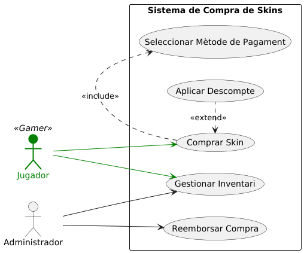
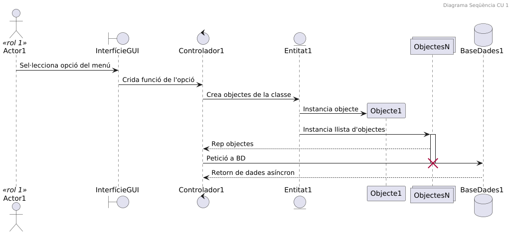
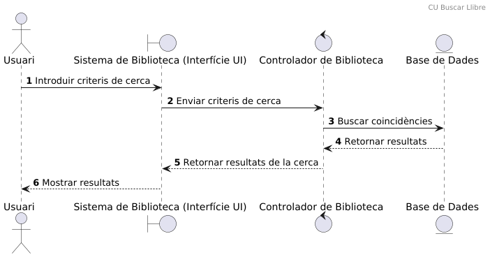
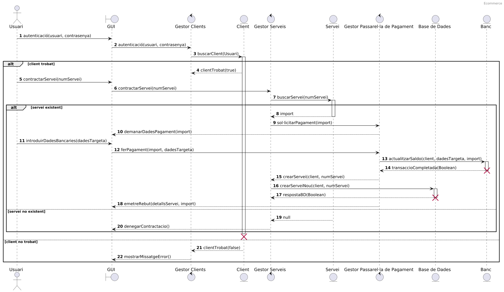

# Exemples de diagrames UML
## Diagrames de Casos d'Ús (CU)
### Diagrama de Casos d'Ús d'una app de Pokémon

## CU Compra Skins

---

## Diagrames de Seqüència
### Diagrama de seqüència del CU: interacció Actor amb Menú

### Diagrama de seqüència: exemple de bloc condicional alt

### Diagrama de seqüència: exemple de bloc iteratiu loop

### Diagrama de seqüència del CU: Prèstec de biblio

### Diagrama de seqüència del CU: Cerca de llibre a biblio 

### Diagrama de seqüència del CU: Contractació de servei

### Diagrama de seqüència dels múltiples CU de Biblioteca

> [!NOTE]
> Dins del package [`uml`](/src/uml) trobareu més exemples en format `.puml`